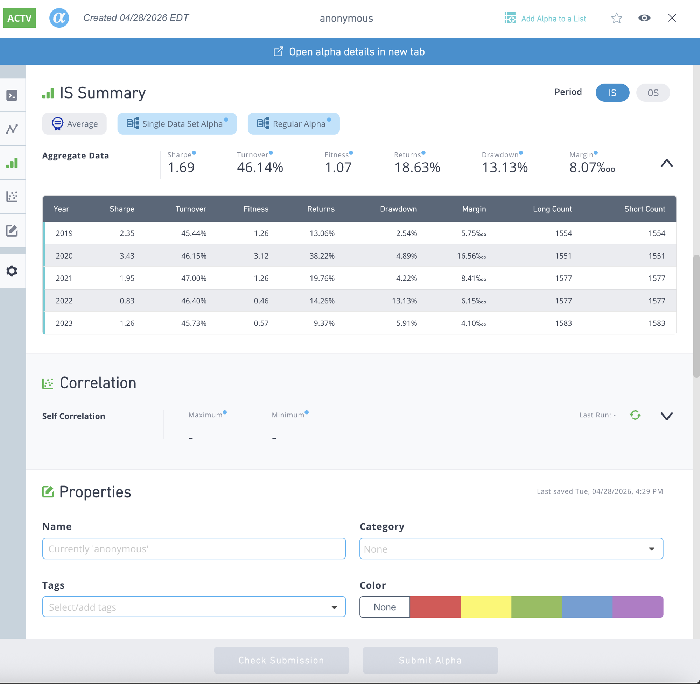

# QuantGPT — Submitted Factors (WQ BRAIN)

Agent-driven factor research engine. Factors below were discovered, optimized, and submitted to WorldQuant BRAIN through QuantGPT's autonomous research loop. All passed IS tests.

---

## Factor 1: Debt-Momentum Composite — **已正式提交 BRAIN**

```
-1 * rank(ts_av_diff(close, 10)) + rank(debt / enterprise_value)
```

| Item | Value |
|------|-------|
| Sharpe | **1.77** |
| Fitness | **1.26** (≥ 1.0 PASS) |
| Turnover | 39.93% |
| Returns | 20.18% |
| Drawdown | 11.29% |
| Neutralization | Industry |
| IS Tests | **全部通过** |
| Status | **Submitted** |

结合动量反转信号（ts_av_diff）与基本面价值信号（debt/enterprise_value），行业中性化。Fitness 1.26 为目前最高。


---

## Factor 2: VWAP 衰减反转 (v2) — **已正式提交 BRAIN**

```
-1 * rank(ts_decay_linear(close / vwap, 10))
```

| Item | Value |
|------|-------|
| Sharpe | **1.69** |
| Fitness | **1.07** (≥ 1.0 PASS) |
| Turnover | 46.14% |
| Returns | 18.63% |
| Drawdown | 13.13% |
| Neutralization | Market |
| IS Tests | **全部通过** |
| Status | **Submitted** |




---

## Factor 3: VWAP 衰减反转 (v1) — **已正式提交 BRAIN** (alpha_id: `78aAQjoL`)

```
-1 * rank(ts_decay_linear(close / vwap, 10))
```

| Item | Value |
|------|-------|
| Sharpe | **1.69** |
| Fitness | **1.07** (≥ 1.0 PASS) |
| Turnover | 46.14% |
| Returns | 18.63% |
| Neutralization | Market |
| IS Tests | **全部通过** |
| Status | **Submitted** |

首个 Agent 产出的正式提交因子。突破关键：Agent 自主发现将中性化从 SUBINDUSTRY 切到 MARKET，Fitness 从 0.88 → 1.07。

---

## Summary

| Factor | Expression | WQ Sharpe | WQ Fitness | Returns | IS PASS | Status |
|--------|-----------|-----------|-----------|---------|---------|--------|
| Debt-Momentum Composite | `-1 * rank(ts_av_diff(close, 10)) + rank(debt / enterprise_value)` | 1.77 | 1.26 | 20.18% | 7/7 | **Submitted** |
| VWAP 衰减反转 (v2) | `-1 * rank(ts_decay_linear(close / vwap, 10))` | 1.69 | 1.07 | 18.63% | 7/7 | **Submitted** |
| VWAP 衰减反转 (v1) | `-1 * rank(ts_decay_linear(close / vwap, 10))` | 1.69 | 1.07 | 18.63% | 7/7 | **Submitted** |


